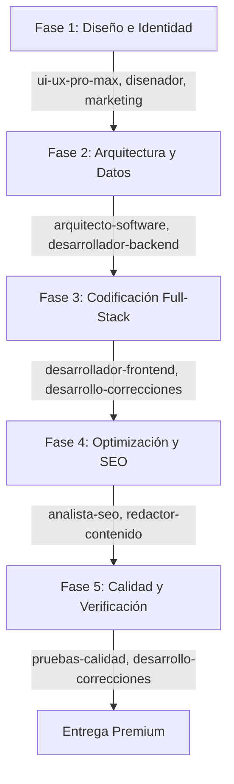

# Instrucciones del Agente - Workspace de Habilidades

## 🧠 Flujo de Orquestación Cognitiva (Multi-Agent Orchestration)

Cuando el usuario te solicite crear, modificar o corregir una página web o aplicación, debes **activar automáticamente** el flujo de trabajo coordinado usando las mejores habilidades del ecosistema. Sigue este procedimiento de forma estricta.

### Paso 1: Escaneo y Mapeo de Habilidades
1. Si tienes permisos de terminal, actualiza y comprueba la disponibilidad de habilidades:
   `python3 .agent/skills/agent-orchestrator/scripts/scan_registry.py`
2. Si no hay permisos de terminal, busca en la carpeta `.agent/skills/` utilizando las herramientas del sistema para cargar las reglas de las habilidades implicadas en la tarea.

### Paso 2: Flujo en Cascada (Cascading Workflow) para Creación de Páginas

Debes dividir la tarea y aplicar los lineamientos de cada rol de forma secuencial:



#### 🎨 Fase 1: Diseño y Estética Premium (`ui-ux-pro-max`, `disenador`, `marketing`)
- **Estilo:** Aplica una paleta HSL armónica (modo oscuro/claro balanceado), tipografías modernas (Google Fonts), y animaciones/micro-interacciones fluidas. Evita colores planos genéricos.
- **Estructura visual:** Diseña layouts limpios y modernos (Bento Grid, asimetría controlada) y responsivos.
- **Copywriting:** El texto debe seguir el embudo AIDA (Atención, Interés, Deseo, Acción).

#### 🏗️ Fase 2: Arquitectura y Datos (`arquitecto-software`, `desarrollador-backend`)
- **Separation of Concerns (SoC):** Separa la presentación de la lógica de negocio y las llamadas a la API.
- **Modelado:** Utiliza validación de datos estricta (Zod o Pydantic) y diseña endpoints limpios y RESTful.

#### 💻 Fase 3: Frontend y Backend (`desarrollador-frontend`, `desarrollador-backend`, `desarrollo-correcciones`)
- **SOLID:** Sigue los principios SOLID, mantén componentes modulares, legibles y reutilizables.
- **Seguridad:** Nunca almacenes tokens sensibles en `localStorage`; usa cookies HTTP-only o estados efímeros en memoria.
- **Interacción:** Asegura transiciones suaves (150-300ms) y estados de carga/error visibles en hovers y formularios.

#### 🔍 Fase 4: SEO y Accesibilidad (`analista-seo`, `redactor-contenido`)
- **Marcado Semántico:** Un solo `<h1>` por página, jerarquía `<h2>-<h6>` correcta y etiquetas HTML5 (`<main>`, `<section>`, `<article>`, `<header>`, `<footer>`).
- **A11y:** Atributos ARIA necesarios y contraste de color conforme a WCAG 2.2 AA.
- **Meta:** Título descriptivo, meta-descripción atractiva e IDs únicos en todos los elementos interactivos.

#### 🧪 Fase 5: Aseguramiento de Calidad (`pruebas-calidad`, `desarrollo-correcciones`)
- **Validación:** Comprueba flujos de error, datos inválidos y accesibilidad antes de considerar la tarea completada.

---

## 🛠️ Comandos de Utilidad

| Tarea | Comando |
| :--- | :--- |
| **Escanear Habilidades** | `python3 .agent/skills/agent-orchestrator/scripts/scan_registry.py` |
| **Buscar Habilidad** | `python3 .agent/skills/agent-orchestrator/scripts/match_skills.py "<solicitacao>"` |
| **Crear Nueva Habilidad** | `python3 .agent/skills/creador-habilidades/scripts/creador.py` |
| **Importar Habilidades** | `python3 scripts/importar_awesome_skills.py` |
| **Importar Todo** | `python3 scripts/importar_todos.py` |

---

## 📝 Atribución de Commits
Los commits de IA en este repositorio deben incluir la siguiente línea de coautoría:
```
Co-Authored-By: Antigravity Developer Agent <antigravity@google.com>
```
