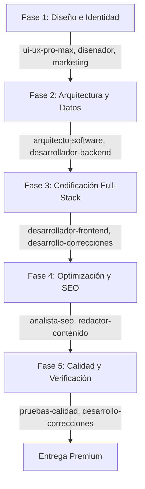

# 👁️ Proyecto Osiris: AI Agent Orchestration Workspace

```text
              ▲
             / \
            / 👁 \
           /_____\       ⚡ PROYECTO OSIRIS ⚡
          /       \      AI Agent Orchestration Terminal

  █▀▀█ █▀▀ ░▀░ █▀▀█ ░▀░ █▀▀ 
  █  █ ▀▀█ ▀█▀ █▄▄▀ ▀█▀ ▀▀█ 
  ▀▀▀▀ ▀▀▀ ▀▀▀ ▀ ▀▀ ▀▀▀ ▀▀▀ 
```

> [!IMPORTANT]
> **Proyecto Osiris** es un entorno unificado y avanzado de desarrollo de agentes de Inteligencia Artificial. Está diseñado para coordinar, orquestar y automatizar más de **1,480 habilidades técnicas** utilizando una arquitectura cognitiva en cascada (Cascading Multi-Agent Orchestration).

---

## 🧠 Arquitectura Cognitiva de Osiris

Osiris funciona bajo un modelo de orquestación secuencial inteligente gobernado por [CLAUDE.md](file:///media/andres/github/habilidades/CLAUDE.md) y [AGENTS.md](file:///media/andres/github/habilidades/AGENTS.md). Cuando solicitas el desarrollo de un proyecto o página web, Osiris activa secuencialmente sus módulos:



---

## 💻 Osiris CLI Terminal Client

Osiris incluye una consola interactiva local potenciada por la API de **Gemini** (`gemini-2.5-flash`) que sirve como centro de mando autónomo.

### Comandos Disponibles:
*   `/chat <pregunta>`: Consulta a la IA sobre el workspace o solicita correcciones de código.
*   `/skills`: Muestra el catálogo de habilidades mapeadas.
*   `/match <tarea>`: Analiza qué habilidades del catálogo son ideales para resolver tu solicitud.
*   `/optimize <prompt>`: Reescribe técnicamente cualquier prompt para evitar errores de autocompletado del IDE.
*   `/dir <ruta>`: Cambia el directorio de trabajo del proyecto activo sobre la marcha.
*   `/create <concepto>`: **Genera en equipo y en paralelo** los archivos estructurados (`index.html`, `index.css`, `server.js`, `test.js`, `robots.txt`, `arquitectura.md`) en la carpeta del proyecto.

---

## 🚀 Lanzadores de Escritorio (Doble Clic)

Hemos creado accesos directos para que inicies la consola Osiris CLI directamente desde tu escritorio:
*   **En Linux/macOS:** Copia [osiris.sh](file:///media/andres/github/habilidades/osiris.sh) a tu escritorio.
*   **En Windows:** Copia [osiris.bat](file:///media/andres/github/habilidades/osiris.bat) a tu escritorio.

---

## 🛠️ Habilidades Core en Español (14 Core Skills)

El sistema cuenta con habilidades adaptadas localmente en `.agent/skills/` para guiar al modelo:

| Habilidad | Ubicación | Descripción |
| :--- | :--- | :--- |
| 🧠 **`optimizador-prompts`** | [Ver carpeta](file:///media/andres/github/habilidades/.agent/skills/optimizador-prompts) | Soluciona errores de autocompletado y optimiza tus prompts en el IDE. |
| 🖼️ **`convertidor-imagenes-ui`** | [Ver carpeta](file:///media/andres/github/habilidades/.agent/skills/convertidor-imagenes-ui) | Traduce bocetos y capturas de pantalla a código web limpio. |
| 🎨 **`ui-ux-pro-max`** | [Ver carpeta](file:///media/andres/github/habilidades/.agent/skills/ui-ux-pro-max) | Diseña interfaces premium con HSL, tipografías modernas y transiciones. |
| ✏️ **`disenador`** | [Ver carpeta](file:///media/andres/github/habilidades/.agent/skills/disenador) | Creación de Bento Grids, retículas asimétricas y coherencia de marca. |
| 🏗️ **`arquitecto-software`** | [Ver carpeta](file:///media/andres/github/habilidades/.agent/skills/arquitecto-software) | Modelado del software bajo principios SOLID y Separation of Concerns. |
| 💻 **`desarrollador-frontend`** | [Ver carpeta](file:///media/andres/github/habilidades/.agent/skills/desarrollador-frontend) | Codificación de interfaces interactivas responsivas. |
| ⚙️ **`desarrollador-backend`** | [Ver carpeta](file:///media/andres/github/habilidades/.agent/skills/desarrollador-backend) | APIs seguras y robustas con validaciones estrictas de datos. |
| 🚀 **`marketing`** | [Ver carpeta](file:///media/andres/github/habilidades/.agent/skills/marketing) | Estructura de copys y funnels con metodología AIDA. |
| 🔧 **`desarrollo-correcciones`** | [Ver carpeta](file:///media/andres/github/habilidades/.agent/skills/desarrollo-correcciones) | Depuración ágil, refactorizaciones y corrección de bugs. |
| 📝 **`redactor-contenido`** | [Ver carpeta](file:///media/andres/github/habilidades/.agent/skills/redactor-contenido) | Documentación de software clara y guías de onboarding. |
| 🔍 **`analista-seo`** | [Ver carpeta](file:///media/andres/github/habilidades/.agent/skills/analista-seo) | HTML5 semántico, optimización de velocidad y SEO técnico. |
| 🧪 **`pruebas-calidad`** | [Ver carpeta](file:///media/andres/github/habilidades/.agent/skills/pruebas-calidad) | Suite de pruebas funcionales (QA) y de accesibilidad. |
| 📅 **`gestor-proyectos`** | [Ver carpeta](file:///media/andres/github/habilidades/.agent/skills/gestor-proyectos) | Sprint backlog, priorización de requerimientos y mitigación de riesgos. |
| 🛠️ **`creador-habilidades`** | [Ver carpeta](file:///media/andres/github/habilidades/.agent/skills/creador-habilidades) | Creador dinámico de nuevas habilidades y roles en español. |

---

## ⚙️ Configuración Inicial

1.  **Variable de Entorno:**
    Asegúrate de exportar tu API Key de Gemini:
    ```bash
    export GEMINI_API_KEY="tu-api-key-aqui"
    ```
2.  **Organizar Assets:**
    Para sincronizar el logo oficial y banner en tu carpeta local, corre:
    ```bash
    python3 scripts/organizar_assets.py
    ```

---

Co-Authored-By: Antigravity Developer Agent <antigravity@google.com>
